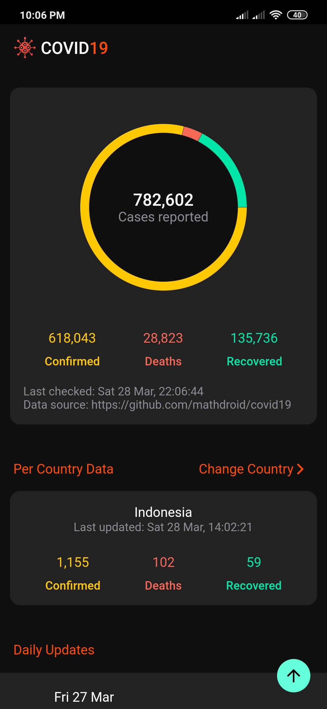
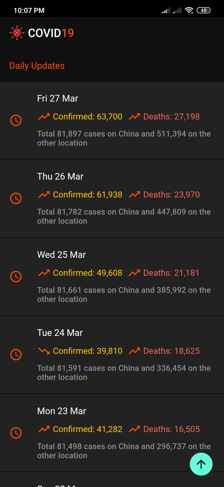
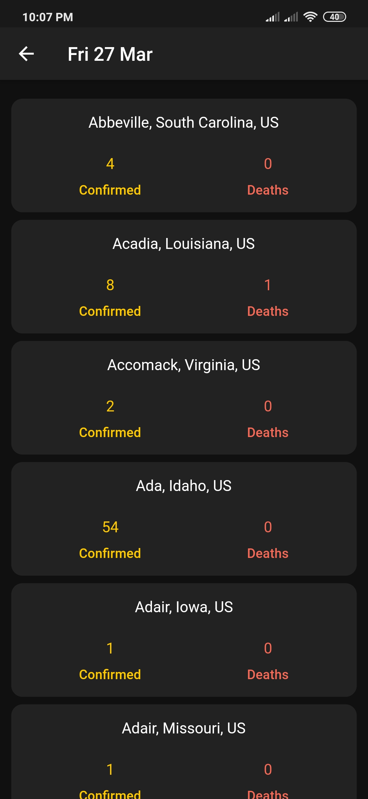

APK Download: https://github.com/Vellutia/covid19_monitor/releases

# covid19_monitor

Personal project with learning purposes.

### Packages

- [flutter_bloc](https://pub.dev/packages/flutter_bloc) - A predictable state management library that helps implement the [BLoC design pattern](https://www.didierboelens.com/2018/08/reactive-programming---streams---bloc/).
- [hydrated_bloc](https://pub.dev/packages/hydrated_bloc) - An extension to the `bloc` state management library which automatically persists and restores `bloc` states, by [Felix Angelov](https://github.com/felangel).
- [equatable](https://pub.dev/packages/equatable) - Simplify Equality Comparisons.
- [get_it](https://pub.dev/packages/get_it) - Simple Service Locator for Dart and Flutter projects with some additional goodies highly inspired by [Splat](https://github.com/reactiveui/splat).
- [fl_chart](https://pub.dev/packages/fl_chart) - 💥 A library to draw fantastic charts in Flutter 💥
- [auto_size_text](https://pub.dev/packages/auto_size_text) - Flutter widget that automatically resizes text to fit perfectly within its bounds.

### Powered by

- [mathdroid](https://github.com/mathdroid)/[covid-19-api](https://github.com/mathdroid/covid-19-api) - COVID-19 global data (from JHU CSSE for now) as-a-service.

### Design clone of

- [rizmaulana](https://github.com/rizmaulana)/[kotlin-mvvm-covid19](https://github.com/rizmaulana/kotlin-mvvm-covid19) - This repository contains simple COVID19 data monitoring with android stack MVVM, Live Data, Koin, RxJava, RxBinding, Offline first with simple caching, etc

## Examples

<pre>
          
</pre>

## License

   Copyright 2020, Vellutia

   Licensed under the Apache License, Version 2.0 (the "License");
   you may not use this file except in compliance with the License.
   You may obtain a copy of the License at

       http://www.apache.org/licenses/LICENSE-2.0

   Unless required by applicable law or agreed to in writing, software
   distributed under the License is distributed on an "AS IS" BASIS,
   WITHOUT WARRANTIES OR CONDITIONS OF ANY KIND, either express or implied.
   See the License for the specific language governing permissions and
   limitations under the License.
